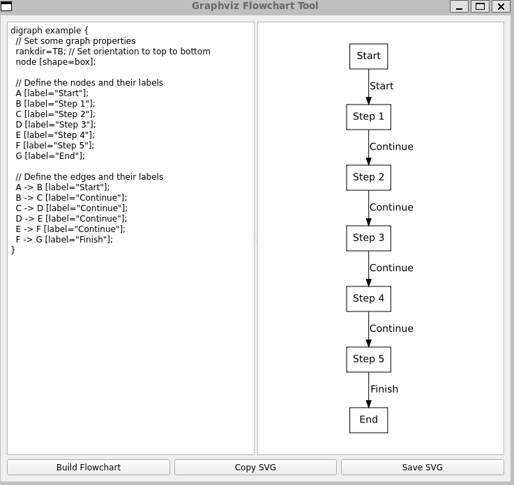

# Graphviz Flowchart Tool

Graphviz Flowchart Tool is a simple and user-friendly application for creating flowcharts using Graphviz's DOT language. The application allows you to write DOT code, generate an SVG flowchart from the code, and save or copy the SVG to your clipboard.

## Installation

1. Ensure you have [Python 3](https://www.python.org/downloads/) installed on your system.
2. Install Graphviz, if you haven't already, using the instructions for your operating system from the [Graphviz website](https://graphviz.org/download/).
3. Clone this repository or download the source code.
4. Navigate to the repository or source code folder and install the required dependencies using the following command:

"pip install -r requirements.txt"

## Usage

1. Run the `main.py` script:
"python main.py"
2. The Graphviz Flowchart Tool window will appear. Enter your DOT code into the left pane.
3. Click the "Build Flowchart" button to generate the flowchart in the right pane.
4. To copy the SVG code to your clipboard, click the "Copy SVG" button.
5. To save the generated SVG as a file, click the "Save SVG" button and choose a location.

## License

This project is licensed under the MIT License. See the [LICENSE](LICENSE) file for more details.
