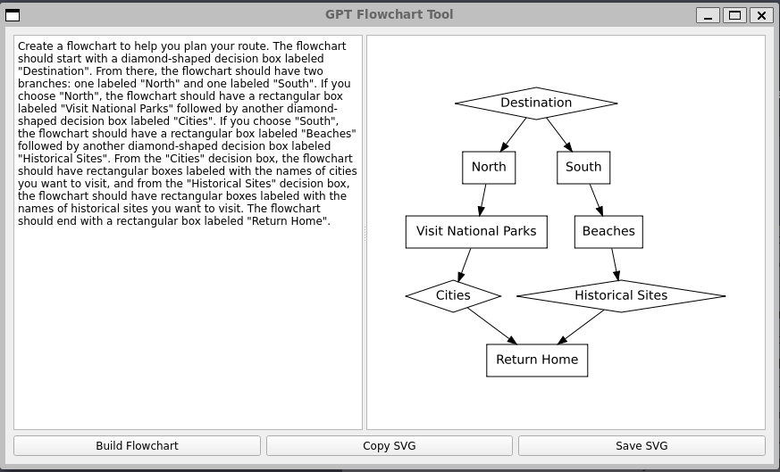

# GPT Flowchart Tool

GPT Flowchart Tool is a simple and user-friendly application for creating flowcharts. It takes in description of flowchart and creates flowcharts based on those description.

Add GPT token at:
'''/src/config/config.ini'''

## Installation

Install graphviz:

Ubuntu: 
Run ./install_graphviz.sh

Windows:
Download graphviz: https://graphviz.org/download/
1. Search for "Environment Variables" in the Start menu and open the "Edit the system environment variables" option.
2. Click on the "Environment Variables" button at the bottom of the System Properties window.
3. Under "System Variables", find the "Path" variable and click "Edit".
4. Click "New" and add the path to the "bin" directory of your Graphviz installation (e.g. "C:\Program Files\Graphviz\bin").
5. Click "OK" to close all windows and save the changes.

"pip install -r requirements.txt"

## Usage

1. Install "make install"
2. Run tool using "make run"
3. Add description in left text input box and hit build flowchart

## License

This project is licensed under the MIT License. See the [LICENSE](LICENSE) file for more details.
